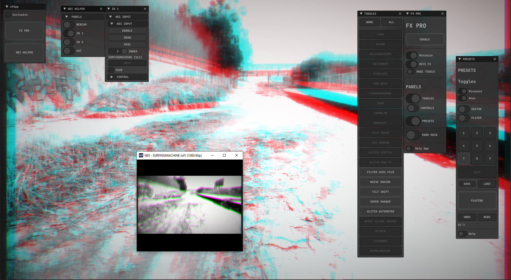

## WIP

Effects Core powered by [**@alptugan**](https://github.com/alptugan) and [**@neilmendoza**](https://github.com/neilmendoza) from: [ofxPostProcessing](https://github.com/alptugan/ofxPostProcessing)

### Dependencies

- [ofxSurfingHelpers](https://github.com/moebiussurfing/ofxSurfingHelpers)
- [ofxSurfingImGui](https://github.com/moebiussurfing/ofxSurfingImGui)
- [ofxSurfingPlayer](https://github.com/moebiussurfing/ofxSurfingPlayer)
- [ofxSurfingPresets](https://github.com/moebiussurfing/ofxSurfingPresets)
- [ofxSurfingRandomizer](https://github.com/moebiussurfing/ofxSurfingRandomizer)
- [ofxSurfingUndoHelper](https://github.com/moebiussurfing/ofxSurfingUndoHelper)
- [ofxImGui](https://github.com/Daandelange/ofxImGui/) / Fork

## example_01-FxPro
- [ofxWindowApp](https://github.com/moebiussurfing/ofxWindowApp)

## example_02-FxPro_NDI
- [ofxWindowApp](https://github.com/moebiussurfing/ofxWindowApp)
- [ofxNDIHelper](https://github.com/moebiussurfing/ofxNDIHelper)
- [ofxNDI](https://github.com/leadedge/ofxNDI)
- [ofxSurfingBox](https://github.com/moebiussurfing/ofxSurfingBox)
- [ofxChildFrame](https://github.com/nariakiiwatani/ofxChildFrame)

## example_03-FxPro_VideoSkip
WIP  

## Screencast

## Tested System
Windows 10 / Visual Studio 2022 / openFrameworks ~0.11.2 | patch-release branch
